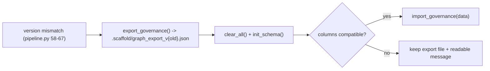

# AgentScaffold Schema Migration / Export Safety + Prune

## 0. Metadata
- Issue: #TBD
- Branch: feature/agentscaffold-migration-prune
- Author: AI agent
- Reviewers: Dave Robb
- Approval Required: Yes (data migration -- see Approval Gates)
- Security Review: Partial (changes graph persistence / data lifecycle)
- Architecture Layer(s): Cross-Cutting (AgentScaffold tooling package)
- Superseded By: None

## 1. Objective
Stop schema-version bumps from silently destroying user/agent knowledge, and give operators a safe way to trim old governance data. Success means: on a schema-version mismatch the pipeline exports preserved governance (`ReviewFinding`, `BacklogItem`, `Session`, `GraphMeta` and their edges) to a JSON file, rebuilds, and re-imports compatible data (keeping the export file with a readable message when columns are incompatible); and a new `scaffold graph prune` command can selectively delete old resolved findings, archived backlog items, and old sessions, dry-run by default and requiring `--apply` to delete.

## 2. Non-Goals
- Not migrating derived code data (files/functions/etc.) -- those are always rebuilt from source.
- Not adding automatic TTL/scheduled pruning (prune is manual and explicit).
- Not changing the schema itself (this plan adds migration plumbing, not new tables).

## 3. Constraints / Invariants
- Must not break: existing `run_pipeline` happy path, `clear_all`, `clear_derived`, governance ingestion.
- Backward compatibility: export format is versioned (`graph_export_v{old}.json`); import tolerates added/removed columns via per-table compatibility checks.
- Performance constraints: export/import only touches preserved governance tables (small relative to code nodes).
- Security constraints: export file is written under `.scaffold/`; it contains project governance text only (no secrets). Document its location and that it is safe to delete.
- Data integrity constraints: migration must never delete the old data before a successful export; on incompatibility it must keep the export file and warn rather than lose data.
- Breaking change: No (additive migration path + new command); the prune command can delete data only behind `--apply`.

## 4. Current State
On a schema-version mismatch, `run_pipeline` ([pipeline.py](src/agentscaffold/graph/pipeline.py) 58-67) calls `store.clear_all()`, which deletes the entire DuckDB file -- wiping `ReviewFinding`, `BacklogItem`, and `Session` knowledge that `clear_derived()` is otherwise careful to preserve. There is no export/import path. Governance modules ([findings.py](src/agentscaffold/graph/findings.py), [sessions.py](src/agentscaffold/graph/sessions.py), [backlog.py](src/agentscaffold/graph/backlog.py)) only record/resolve/list; there is no selective delete and no `scaffold graph prune` command. `get_stats()` ([duckpgq_backend.py](src/agentscaffold/graph/duckpgq_backend.py) 534) does not report `Session` counts.

## 5. Target State
Migration: the backend exposes `export_governance() -> dict` and `import_governance(data)` covering `ReviewFinding`, `BacklogItem`, `Session`, `GraphMeta` and preserved edges (`FINDING_ABOUT_FILE`, `FINDING_ABOUT_FUNC`, `FINDING_LED_TO`, `FINDING_ADDRESSED_BY`, `SESSION_MODIFIED`, `BACKLOG_ITEM_OF`) with per-table column compatibility checks. `run_pipeline` re-sequences on version mismatch: export to `.scaffold/graph_export_v{old}.json` -> `clear_all()` -> `init_schema()` -> `import_governance` (or keep the export file + warn if incompatible).

Prune: a new [graph/prune.py](src/agentscaffold/graph/prune.py) and a `scaffold graph prune` command (after `graph verify` in [cli.py](src/agentscaffold/cli.py)) with `--resolved-findings-before <Nd>`, `--sessions-before <Nd>`, `--archived-backlog-before <Nd>`; dry-run by default, `--apply` required to delete; status-aware (only `resolved` findings, `archived` backlog, sessions past cutoff). Selective-delete helpers are added to findings/sessions/backlog, and `get_stats()` reports `Session`.



## 6. File Impact Map
| File | Change Type | Notes |
|------|-------------|-------|
| src/agentscaffold/graph/duckpgq_backend.py | Modify | Add `export_governance()`, `import_governance(data)`, per-table compat checks; add `Session` to `get_stats()` |
| src/agentscaffold/graph/pipeline.py | Modify | Re-sequence version-mismatch path: export -> clear_all -> init_schema -> import (or keep + warn) |
| src/agentscaffold/graph/prune.py | Create | Selective prune logic (cutoff parsing, status-aware selection, dry-run summary) |
| src/agentscaffold/graph/findings.py | Modify | Add selective-delete helper (resolved findings before cutoff) |
| src/agentscaffold/graph/sessions.py | Modify | Add selective-delete helper (sessions before cutoff) |
| src/agentscaffold/graph/backlog.py | Modify | Add selective-delete helper (archived backlog before cutoff) |
| src/agentscaffold/cli.py | Modify | Add `scaffold graph prune` command after `graph verify` |
| docs/user-guide.md | Modify | Document migration export file + `scaffold graph prune` |
| tests/test_graph_migration.py | Create | Export/import round-trip + incompatible-column path + pipeline migration preserves findings |
| tests/test_graph_prune.py | Create | Dry-run vs `--apply`, status-aware selection, cutoff parsing |

## 7. Tests
| Test File | Coverage Target | Notes |
|-----------|-----------------|-------|
| tests/test_graph_migration.py | export/import round-trip; incompatible columns keep export + warn; version-mismatch pipeline preserves findings/sessions/backlog | Real DuckDB file DB |
| tests/test_graph_prune.py | dry-run default (no deletes), `--apply` deletes, status-aware (open findings untouched), cutoff `Nd` parsing | CLI + helper level |

Test approach:
- [ ] Unit tests: cutoff parsing, compatibility check, selective-delete helpers
- [ ] Integration tests: simulate version bump (write old version into GraphMeta), run pipeline, assert preserved data survives
- [ ] Edge cases: empty governance export; incompatible column set; prune with nothing eligible; `--apply` vs dry-run

## 8. Execution Steps
- [x] Step 0: Consumer audit -- confirm all `clear_all()` callers and the migration path; verify no other code assumes `clear_all` preserves nothing
- [x] Step 1: Add `export_governance()` / `import_governance(data)` + compat checks to the backend; add `Session` to `get_stats()`
- [x] Step 2: Write migration tests (round-trip + incompatible + pipeline preservation) first
- [x] Step 3: Re-sequence the pipeline version-mismatch path to export -> rebuild -> import. **Fail-closed (per approval feedback): if `export_governance()` fails, abort the rebuild and raise; the existing graph is left intact and nothing is destroyed. Incompatible re-import keeps the export file and warns.**
- [x] Step 4: Add selective-delete helpers to findings/sessions/backlog
- [x] Step 5: Add `graph/prune.py` and the `scaffold graph prune` CLI command (dry-run default, `--apply` to delete)
- [x] Step 6: Write prune tests
- [x] Step 7: Document migration export + prune in `docs/user-guide.md`
- [x] Step 8: Run ruff + full pytest

## 9. Validation
```bash
ruff format src tests
ruff check src tests
uv run python -m pytest tests -q
```

Expected results:
- Ruff: no errors
- Pytest: all tests pass

## 10. Rollback Plan
`git revert` the commit. The migration only adds an export-before-wipe step and an import-after-rebuild step; reverting restores the prior `clear_all()` behavior. Any `graph_export_v{old}.json` files written remain on disk and are safe to delete. The prune command is new and additive; reverting removes it with no residual state.

## 11. Risks & Mitigations
- Risk (data loss): a bug in export/import loses governance during migration. Mitigation: never delete before a successful export; on import incompatibility keep the export file and print its path; round-trip and pipeline-preservation tests gate the change.
- Risk (accidental deletion via prune): Mitigation: dry-run by default; deletion requires explicit `--apply`; only status-eligible rows (resolved/archived/past-cutoff) are ever selected; deletes are scoped per-table.
- Risk (trust boundary): export file under `.scaffold/`. Mitigation: it contains only project governance text already in the repo's graph; documented as safe to delete; no secrets are exported.
- Risk (incompatible schema columns): Mitigation: per-table column intersection on import; missing columns default to NULL/empty; extra columns are dropped with a logged note.

## 12. Completion Checklist
- [x] All execution steps checked off
- [x] Tests written and passing (600 passed; 16 new migration/prune tests)
- [x] No linter errors (ruff, mypy)
- [x] workflow_state.md updated
- [x] Session log entry added (if multi-session) -- see workflow_state.md "Released (2026-06-14): AgentScaffold 0.6.0" record + batch retrospective
- [x] Code reviewed (self or peer)
- [x] Approval obtained (required -- data migration)

Status: COMPLETE -- shipped in AgentScaffold 0.6.0 (2026-06-14).
