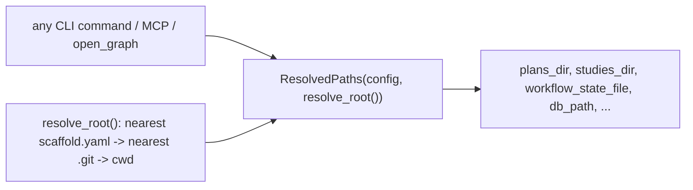

# Refactor: AgentScaffold Path/Root Unification

## 0. Metadata
- Issue: #TBD
- Branch: refactor/agentscaffold-path-root-unification
- Author: AI agent
- Reviewers: Dave Robb
- Approval Required: Yes (breaking change to path resolution + additive config schema)
- Security Review: None (internal refactor; no new persistence or external surface)
- Architecture Layer(s): Cross-Cutting (AgentScaffold tooling package)
- Superseded By: None
- Source: STU-2026-06-14-agentscaffold-multiproject-collab-durability (Thread 1); SPIKE-2026-06-14-agentscaffold-path-root-unification (decision: proceed)

## 1. Objective
Give AgentScaffold one project-root rule and one resolved-paths accessor so every command resolves governance paths the same way. Success means: (a) a single `resolve_root()` returns the project root (nearest `scaffold.yaml`, fallback nearest `.git`, fallback cwd); (b) a single `ResolvedPaths` object derives all governance paths from `GraphConfig` joined to that root; (c) the ~11 CLI commands that currently hardcode `docs/ai/*` honor `GraphConfig`; (d) `open_graph()` resolves `db_path` relative to the project root (matching `run_pipeline`); and (e) an uncustomized single-project repo behaves exactly as it does today (verified by tests).

## 2. Non-Goals
- Not adding multi-project/workspace support (that is a Phase 2 plan that builds on this).
- Not adding config inheritance/`extends:` (Phase 2).
- Not changing the on-disk default layout (`docs/ai/...`) or the graph schema.
- Not changing genuinely cwd-relative behaviors (e.g. "index the current directory") into root-relative ones.

## 3. Constraints / Invariants
- Must not break: `scaffold init`, `scaffold index`, `scaffold plan/spike/study/retro/validate/metrics` commands, MCP server path resolution, `graph/governance.py` ingestion.
- Backward compatibility: Required. `GraphConfig` defaults already equal the hardcoded literals, so an uncustomized repo must produce identical paths. New config fields must default to today's literals.
- Performance constraints: Must not regress (path resolution is trivial; computed once per command).
- Security constraints: None new.
- Data integrity constraints: `db_path` resolution change must not point at a different DB for existing repos run from the repo root (the common case is unchanged; only subdir invocation changes, and toward correctness).
- Breaking change: Yes -- customized `graph.*` paths will now take effect in CLI commands that previously ignored them, and `open_graph` will join `db_path` to the project root instead of cwd. See Migration Plan.

## 4. Current State
Three notions of "root" coexist: `find_config()` walk-up (config.py), `Path.cwd()` (~38 usages across ~18 modules), and explicit CLI directory args. Two path systems coexist: `GraphConfig` path fields (config.py:215-221) honored by the graph/MCP layer, versus hardcoded `Path("docs/ai/plans")`-style literals in CLI commands that ignore the config. `open_graph()`/`_resolve_db_path` (graph/__init__.py) resolves `db_path` relative to process cwd, while `run_pipeline()` (graph/pipeline.py) joins it to the index root -- a latent divergence. `GraphConfig` also lacks fields the code already uses as literals (backlog, standards, prompts, templates, plan_completion_log, security). Full callsite catalog: SPIKE-2026-06-14-agentscaffold-path-root-unification.

## 5. Target State
A new resolution module exposes `resolve_root(start=None) -> Path` and `ResolvedPaths` (built from `(config, root)`), with every governance path derived from `GraphConfig` joined to root. CLI commands and `open_graph` consume the accessor. `GraphConfig` gains additive fields (backlog_file, backlog_archive_file, standards_dir, prompts_dir, templates_dir, plan_completion_log_file, security_dir) defaulting to the current literals. `open_graph` joins `db_path` to `resolve_root()`. Genuinely cwd-relative callsites are classified and left as-is (documented).



## 6. Migration Plan (if breaking)
- [ ] Defaults preserve behavior: every new/derived path defaults to the existing literal, so repos that never customized `graph.*` are unaffected.
- [ ] Document in CHANGELOG (Changed): customized `graph.*` paths now apply to all CLI commands; `open_graph` resolves `db_path` from the project root. Repos that relied on running graph queries from a subdirectory with a relative `db_path` should set an absolute `db_path` or run from the root.
- [ ] Provide a one-line note in `docs/user-guide.md` troubleshooting for the db_path resolution change.

## 7. File Impact Map
| File | Change Type | Notes |
|------|-------------|-------|
| src/agentscaffold/config.py | Modify | Add additive `GraphConfig` path fields (backlog_file, backlog_archive_file, standards_dir, prompts_dir, templates_dir, plan_completion_log_file, security_dir), defaults = current literals |
| src/agentscaffold/paths.py | Create | `resolve_root()` + `ResolvedPaths` accessor (single source of path resolution) |
| src/agentscaffold/graph/__init__.py | Modify | `_resolve_db_path`/`open_graph` join `db_path` to `resolve_root()` |
| src/agentscaffold/plan/create.py | Modify | Use ResolvedPaths.plans_dir |
| src/agentscaffold/plan/lint.py | Modify | Use ResolvedPaths.plans_dir |
| src/agentscaffold/plan/status.py | Modify | Use ResolvedPaths.plans_dir |
| src/agentscaffold/retro/check.py | Modify | Use ResolvedPaths.plans_dir + learnings_file |
| src/agentscaffold/metrics/dashboard.py | Modify | Use ResolvedPaths.plans_dir |
| src/agentscaffold/validate/orchestrator.py | Modify | Use ResolvedPaths.plans_dir |
| src/agentscaffold/spike/create.py | Modify | Use ResolvedPaths.spikes_dir |
| src/agentscaffold/study/create.py | Modify | Use ResolvedPaths.studies_dir |
| src/agentscaffold/study/list_cmd.py | Modify | Use ResolvedPaths.studies_dir |
| src/agentscaffold/study/lint.py | Modify | Use ResolvedPaths.studies_dir |
| src/agentscaffold/domain_packs/loader.py | Modify | Use ResolvedPaths prompts_dir/standards_dir/security_dir |
| tests/test_paths.py | Create | resolve_root precedence + ResolvedPaths defaults + backward-compat for uncustomized repo |
| tests/test_path_resolution_integration.py | Create | CLI commands honor customized graph.* paths; open_graph resolves from root (run from subdir) |
| docs/user-guide.md | Modify | Note db_path resolution change + that graph.* paths now apply everywhere |

## 8. Tests
| Test File | Coverage Target | Notes |
|-----------|-----------------|-------|
| tests/test_paths.py | resolve_root precedence (scaffold.yaml > .git > cwd); ResolvedPaths defaults equal current literals | Unit, tmp dirs |
| tests/test_path_resolution_integration.py | plan/study/spike commands write under customized dirs; open_graph finds DB when invoked from a subdir | Integration, real config |

Test approach:
- [ ] Existing tests continue to pass (no behavior change for uncustomized repos)
- [ ] New tests for resolve_root precedence and ResolvedPaths defaults
- [ ] Edge case: invoked from a subdirectory; customized `graph.plans_dir`; no scaffold.yaml (cwd fallback)

## 9. Execution Steps
- [x] Step 0: Consumer audit -- re-run the spike greps (`docs/ai`, `Path.cwd()`) to confirm the callsite catalog is current; classify each `Path.cwd()` as root-relative vs genuinely cwd-relative
- [x] Step 1: Establish baseline -- run full `pytest -q` green before changes
- [x] Step 2: Add additive `GraphConfig` path fields (defaults = current literals)
- [x] Step 3: Create `paths.py` with `resolve_root()` + `ResolvedPaths`; add `test_paths.py` first
- [x] Step 4: Route the hardcoded CLI callsites through `ResolvedPaths` (small commits per command group)
- [x] Step 5: Fix `open_graph`/`_resolve_db_path` to join `db_path` to `resolve_root()`; add subdir integration test
- [x] Step 6: Update CHANGELOG + configuration-reference note; run full validation
- [x] Step 7: Verify backward-compat tests pass for an uncustomized repo

**Implementation note**: Routed the catalog callsites (`plan/create`, `plan/lint`,
`plan/status`, `retro/check`, `metrics/dashboard`, `validate/orchestrator`,
`spike/create`, `study/create`, `study/list_cmd`, `study/lint`,
`domain_packs/loader`) through `ResolvedPaths`. Added a shared
`paths.resolve_db_path()` used by both `open_graph`/`graph_available` and
`run_pipeline` so index-time and query-time DB locations agree. 611 tests pass
(was 600; +11 across `test_paths.py` and `test_path_resolution_integration.py`);
ruff clean. The MCP/init/generated-string literals were left as documentation
text per the spike (not behavioral path resolution).

## 10. Validation
```bash
cd .
ruff format .
ruff check .
pytest -q
```

Expected results:
- Ruff: no errors
- Pytest: all existing + new tests pass; uncustomized-repo paths unchanged

## 11. Rollback Plan
- Git revert strategy: the refactor lands as a series of small commits on `refactor/agentscaffold-path-root-unification`; revert the branch merge to restore prior behavior. `paths.py` is additive, so reverting callsite edits restores the hardcoded literals.
- Data migration reversal: none (no data changes).
- Feature flag: not required; defaults preserve behavior, so partial rollback (keeping `paths.py` but reverting a callsite) is safe.

## 12. Risks & Mitigations
| Risk | Likelihood | Impact | Mitigation |
|------|------------|--------|------------|
| `open_graph` db_path change points an existing subdir workflow at a new empty DB | Low | Medium | Defaults unchanged for repo-root invocation; document in Migration Plan; add subdir integration test |
| Misclassifying a genuinely cwd-relative callsite as root-relative | Medium | Medium | Explicit Step 0 classification; only route the cataloged governance-path callsites; leave others |
| Hidden consumer of a hardcoded literal not in the catalog | Low | Medium | Re-run greps in Step 0; rely on full test suite + integration test |

## 13. Completion Checklist
- [x] All execution steps checked off
- [x] All existing tests still pass
- [x] New tests written for refactored code
- [x] No linter errors
- [x] workflow_state.md updated
- [x] Code reviewed (self)
- [x] Rollback tested (for critical refactors) -- defaults preserve behavior; reverting callsite edits restores literals
