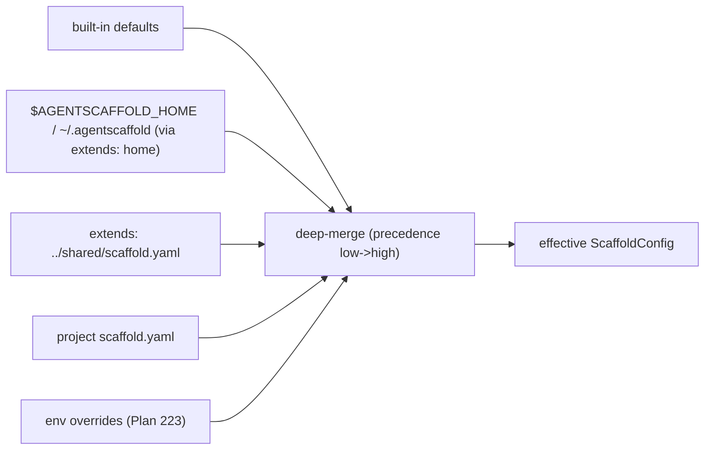

# Feature: AgentScaffold Config Inheritance (shared policy)

## 0. Metadata
- Issue: #TBD
- Branch: feature/agentscaffold-config-inheritance
- Author: AI agent
- Reviewers: Dave Robb
- Approval Required: Yes (changes config resolution precedence; adds a new trust boundary that reads org/user-level config)
- Security Review: Partial (new read of an org/user-level config location influences project gates/approval behavior; document the trust boundary)
- Architecture Layer(s): Cross-Cutting (AgentScaffold tooling package)
- Superseded By: None
- Source: STU-2026-06-14-agentscaffold-multiproject-collab-durability (Thread 4, Phase 2). Depends on Plan 221 (path/root resolution).

## 1. Objective
Let shared policy (rigor, gates, standards lists, prohibitions, reviewers, approval rules, domains) live in one org/user-level place instead of being copied into every repo and drifting. Success means: (a) a project `scaffold.yaml` can declare `extends:` to inherit from a base config; (b) the base resolves from an explicit path or from an org/user home (`$AGENTSCAFFOLD_HOME`, else `~/.agentscaffold/scaffold.yaml`); (c) effective config is a deterministic deep-merge with clear precedence (built-in defaults < extends chain < project `scaffold.yaml` < environment overrides); (d) a repo with no `extends:` behaves exactly as today; and (e) `scaffold config show` prints the effective merged config so precedence is debuggable.

## 2. Non-Goals
- Not sharing policy *file content* (the markdown under `docs/ai/templates|prompts|standards`). Those are consumed as files by humans/agents; resolving their content from the home is a separate follow-up (noted in Risks) and/or folds into the Thread 5 workspace plan.
- Not adding multi-project namespacing (Thread 5, Plan 225) or file sharding (Thread 6, Plan 226).
- Not fetching remote/HTTP base configs (only local paths + the home dir).
- Not changing the `db_path`/governance resolution from Plans 221-223.

## 3. Constraints / Invariants
- Must not break: `load_config()` callers, `apply_rigor_preset`, `scaffold init`, every command that reads `ScaffoldConfig`.
- Backward compatibility: Required. `extends:` defaults to unset; with no `extends:` and no home config, resolution is byte-for-byte today's behavior.
- Precedence is fixed and documented: built-in defaults < base (via `extends`, recursively) < project `scaffold.yaml` < environment overrides (e.g. `AGENTSCAFFOLD_DB_PATH` from Plan 223). Rigor presets apply after the merge, as today.
- Security constraints: a base/home config can influence gates and approval rules. Document the trust boundary; resolve the home only from `$AGENTSCAFFOLD_HOME` or `~/.agentscaffold` (no implicit network); never execute config content.
- Data integrity constraints: `extends` cycles must be detected and rejected with a clear error; a missing/unreadable base must produce a clear error (not silent fallthrough) unless the base is the optional home (absent home = no-op).
- Breaking change: No (additive `extends` field + additive resolution layer; defaults preserve behavior).

## 4. Current State
`load_config()` (config.py) reads one `scaffold.yaml`, validates it into `ScaffoldConfig`, and applies a rigor preset. There is no inheritance: shared policy (standards lists, gates, reviewers, prohibitions) is duplicated into each repo by `scaffold init` and drifts. A `_deep_merge()` helper already exists (used by `apply_rigor_preset`) and can be reused for the cascade. Plan 221 added `resolve_root()`/`ResolvedPaths`; Plan 223 added env-var resolution -- both establish the resolution conventions this plan extends. No org/user home concept exists yet.

## 5. Target State
`ScaffoldConfig` gains an optional `extends: str | None`. A new resolver loads the raw project YAML, follows `extends` (a path relative to the project, or the literal `home` to use `$AGENTSCAFFOLD_HOME`/`~/.agentscaffold/scaffold.yaml`), recursively builds the base chain, and deep-merges base-under-project into one raw dict before a single `ScaffoldConfig.model_validate` + `apply_rigor_preset`. Cycles and missing explicit bases raise clear errors; an absent home base is a no-op. `scaffold config show` renders the effective config and the provenance (which file contributed `extends`). With no `extends:` the path is unchanged.



## 6. File Impact Map
| File | Change Type | Notes |
|------|-------------|-------|
| src/agentscaffold/config.py | Modify | Add `extends: str | None` to ScaffoldConfig; add cascade resolution in `load_config` (reuse `_deep_merge`); cycle + missing-base handling |
| src/agentscaffold/config_home.py | Create | Resolve the org/user home (`$AGENTSCAFFOLD_HOME` -> `~/.agentscaffold`); locate `home` base config |
| src/agentscaffold/cli.py | Modify | Add `scaffold config show` to print the effective merged config + `extends` provenance |
| tests/test_config_inheritance.py | Create | Cascade precedence, `extends: home`, relative-path base, cycle detection, missing base, no-extends backward-compat |
| docs/configuration.md | Modify | Document `extends`, the home location, precedence order, and the trust boundary |
| CHANGELOG.md | Modify | Note config inheritance under `[Unreleased]` |

## 7. Tests
| Test File | Coverage Target | Notes |
|-----------|-----------------|-------|
| tests/test_config_inheritance.py | precedence (defaults < base < project); `extends: home` via monkeypatched `$AGENTSCAFFOLD_HOME`; relative-path base; multi-level chain; cycle raises; missing explicit base raises; absent home is no-op; no-`extends` unchanged | Unit, tmp dirs + monkeypatched env |

Test approach:
- [x] Write `test_config_inheritance.py` first (test-alongside)
- [x] Existing `test_config.py` continues to pass unchanged (no-`extends` path)
- [x] Edge cases: cycle, missing base, absent home, deep nested override of a single field, list vs scalar override semantics, directory-as-base, non-string extends

## 8. Execution Steps
- [x] Step 0: Consumer audit -- confirmed every config read goes through `load_config()`, so the cascade is centralized there
- [x] Step 1: Establish baseline -- full `pytest -q` green before changes (634)
- [x] Step 2: Added `config_home.py` (home resolution) and the `extends` field; wrote `test_config_inheritance.py` first
- [x] Step 3: Implemented the cascade in `load_config` (recursive `_load_raw_with_extends`, reuses `_deep_merge`, cycle detection, clear errors), preserving rigor-preset-after-merge
- [x] Step 4: Added `scaffold config show` (inheritance chain base-first + effective merged config)
- [x] Step 5: Updated `configuration.md` + CHANGELOG; ran full validation

**Implementation note**: The cascade lives entirely in `load_config` via
`_load_raw_with_extends` (recursive raw-dict merge before a single
`model_validate`), so every consumer inherits it for free. `extends` accepts a
path (relative to the declaring file, or a directory -> its `scaffold.yaml`) or
the literal `home` (resolved by the new `config_home.py` from `$AGENTSCAFFOLD_HOME`
/ `~/.agentscaffold`). Lists are replaced wholesale by the child (documented).
Policy-FILE content sharing (templates/prompts/standards markdown) was kept out
of scope per Non-Goals. 646 tests pass (+12 in `test_config_inheritance.py`);
ruff + mypy clean.

## 9. Validation
```bash
cd .
ruff format .
ruff check .
pytest -q
```

Expected results:
- Ruff: no errors
- Pytest: all existing + new tests pass; no-`extends` repos unchanged; cascade precedence and error cases verified

## 10. Rollback Plan
Revert the feature branch. `extends` and the cascade are additive; with the field unset, resolution is identical to today, so reverting the callsite/loader changes restores prior behavior. No data migration to reverse.

## 11. Risks & Mitigations
| Risk | Likelihood | Impact | Mitigation |
|------|------------|--------|------------|
| Precedence confusion (which layer won) | Medium | Medium | Fixed documented order; `scaffold config show` surfaces the effective values + provenance |
| A home/base config silently weakens gates or approval rules | Low | High | Document the trust boundary; only resolve from `$AGENTSCAFFOLD_HOME`/`~/.agentscaffold`; print the active `extends` source on relevant commands |
| `extends` cycle or missing base causes a confusing failure | Medium | Medium | Explicit cycle detection + clear errors; absent optional home is a no-op |
| Policy-file sharing expected but out of scope | Medium | Low | State in Non-Goals; file-content sharing is a separate follow-up (or folds into Plan 225) |

## 12. Security Review (Partial)
Reading an org/user-level config (`~/.agentscaffold` or `$AGENTSCAFFOLD_HOME`) introduces a new trust boundary: a base config can set rigor, gates, and `approval_required`. Trust model: the home config is owned by the same user/org as the repo checkout, treated as trusted local input; it is parsed as YAML data only (never executed) and resolved only from the explicit env var or the fixed home path (no network, no implicit discovery outside the project + home). Project `scaffold.yaml` always overrides the base, so a repo can tighten but the base cannot silently override a stricter project setting. Document that lowering gates via a shared base is a deliberate, visible act (surfaced by `scaffold config show`).

## 13. Completion Checklist
- [x] All execution steps checked off
- [x] Tests written and passing
- [x] No linter errors (ruff, mypy)
- [x] workflow_state.md updated
- [x] Session log entry added (if multi-session)
- [x] Code reviewed (self)
- [x] Approval obtained (if required) -- approved by daverobb 2026-06-15
