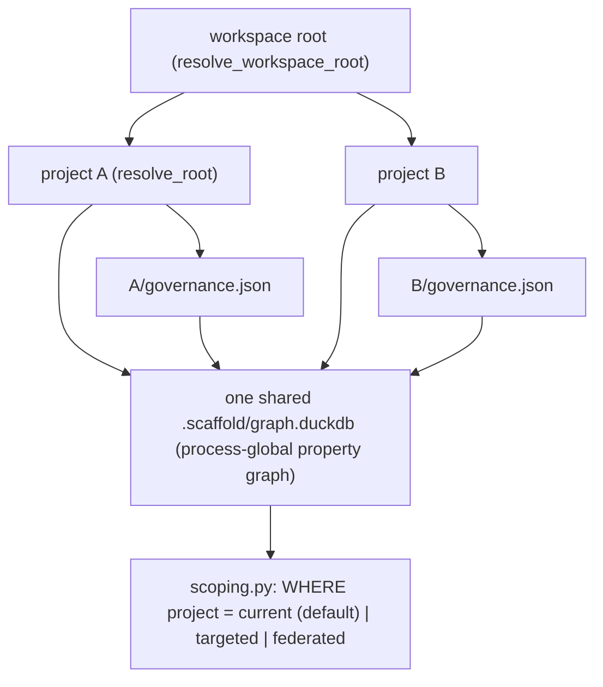

# Refactor: AgentScaffold Namespaced Multi-Project Workspace

## 0. Metadata
- Issue: #TBD
- Branch: feature/agentscaffold-namespaced-workspace
- Author: AI agent
- Reviewers: Dave Robb
- Approval Required: Yes (breaking graph-schema change + data migration + new persistence/visibility boundary across projects)
- Security Review: Partial (multiple projects share one derived cache; cross-project data visibility is a new trust boundary -- document the isolation model)
- Architecture Layer(s): Cross-Cutting (AgentScaffold tooling package)
- Uncertainty: High -- a pre-mortem (2026-06-15) surfaced silent-failure hazards in code paths that today assume one project per graph (ON CONFLICT silent drop, global clears wiping siblings, mode-flip re-key, fail-open reads, unscoped embedding search). **Spike COMPLETE (2026-06-15): all five questions validated; decision = proceed-modify (check-before-insert refinement folded into Step 5/9).**
- Spike (gate, SATISFIED): docs/ai/spikes/SPIKE-2026-06-15-agentscaffold-multiproject-graph-safety.md -- Complete; collision detection, scoped clears, atomic mode-flip, fail-closed GRAPH_TABLE scoping, and embedding scoping/provenance/model-guard all validated on DuckDB 1.4.4 + duckpgq.
- Superseded By: None
- Source: STU-2026-06-14-...durability (Thread 5); SPIKE-2026-06-15-agentscaffold-project-node-workspace (decision: proceed-modify, namespaced); STU-2026-06-15-agentscaffold-cross-project-query-views (scoping-helper design); pre-mortem 2026-06-15 (fault-path analysis folded into Sections 9, 12, 13). Depends on Plans 221 (paths), 222 (governance serialization), 224 (config inheritance).

## 1. Objective
Let one AgentScaffold workspace host multiple projects in a single shared (process-global) DuckPGQ graph, with each node attributed to its owning project and reads scoped to the current project by default. Success means: (a) a `Project` node + a `project` attribute namespace governance and code nodes; (b) IDs are project-qualified only in multi-project workspaces, so single-project repos keep today's IDs (zero migration); (c) a `resolve_workspace_root()` locates the workspace while `resolve_root()` keeps finding the nearest project; (d) governance is serialized per project (reusing Plan 222) and ingested into the one shared graph; (e) reads default to the current project with explicit `--project`/`--all-projects` federation (per STU-2026-06-15); and (f) an uncustomized single-project repo behaves exactly as today.

## 2. Non-Goals
- Not building a live multi-writer/server graph (rejected in the study; git stays the system of record).
- Not collaboration ergonomics (file sharding / `plan claim`) -- that is Plan 226.
- Not cross-project semantic embeddings or cross-project community detection (future).
- Not cross-project *edges*/relationships: each project is indexed independently and no edge spans two projects (a code/governance node in A never links to one in B).
- Not a remote/registry workspace; only a local on-disk workspace of project roots.

## 3. Constraints / Invariants
- Must not break: single-project `scaffold init/index/plan/...` flows, `open_graph`, the Plan 219 migration path, the Plan 222 governance artifact format, MCP handlers.
- Backward compatibility: Required. With no workspace declared, there is exactly one project; IDs are NOT prefixed, the `project` column defaults to that project, and every read predicate is a no-op. Lone repos are byte-for-byte unchanged.
- ID identity: keep single-column `id` primary keys (DuckPGQ edges reference `id`); achieve namespacing by project-qualifying the generated IDs in multi-project mode, NOT by composite keys.
- ID delimiter safety: qualified IDs are `{project}::{raw_id}`. Raw IDs already contain `::` (e.g. `plan::224`), so `qualify_id`/`unqualify_id` split on the FIRST delimiter only, and project names are validated to exclude `::` and whitespace (Step 3). The `project` column is the authoritative scoping key; prefix parsing is a convenience, never the sole source of truth.
- Schema: additive (`Project` node + `project` columns); `SCHEMA_VERSION` bump triggers the Plan 219 fail-closed export -> rebuild -> import path. `GraphMeta` stays a single global row for schema version + pipeline state, but `lastIndexed` becomes per-project (a `lastIndexed` per `Project` node) so re-indexing one project does not misreport another's freshness.
- MCP current-project: the MCP server resolves its project once from its launch root (`resolve_root` at startup). An agent operating in a different project must point at that project's server/config; cross-project routing is explicit, never inferred per-request. Document this so a mis-pointed server is an obvious user error, not a silent leak.
- Security/isolation constraints: one shared cache means cross-project reads are possible by design; default scope is the current project, federation is explicit. Document that the workspace is a single trust domain (all projects belong to the same user/org).
- Breaking change: Yes (SCHEMA_VERSION bump; multi-project ID re-keying on workspace activation). See Migration Plan.

## 4. Current State
One `scaffold.yaml` == one project == one root (Plan 221 `resolve_root()`), one `.scaffold/graph.duckdb`, one `governance.json` (Plan 222/223). Node IDs are global and collidable across projects: `plan::{number}` (governance.py), `file::{path}` (sessions.py), `rf::{sha1(...)}` (findings.py), `bi::{sha1(...)}` (backlog.py); `session::{uuid}` is already unique. The DuckPGQ property graph is process-global and defined over base tables (duckpgq_schema.py), so one shared graph can hold many projects, but `GRAPH_TABLE MATCH` cannot be redirected to per-project views. ~32 read callsites (review/queries.py, graph/{backlog,sessions,prune,findings}.py, search.py, mcp/server.py) build SQL with no project predicate.

## 5. Target State
A workspace is an outer directory whose `scaffold.yaml` (or a `workspace.yaml`) lists project roots (or a single project, the default). `resolve_workspace_root()` finds it; `resolve_root()` still finds the nearest project. Indexing tags every node with its `project` and, in multi-project mode, project-qualifies generated IDs. Governance is serialized per project (Plan 222 artifact per project root) and ingested into the one shared graph. A new `graph/scoping.py` exposes `current_project()` + predicate builders for plain-SQL and `GRAPH_TABLE` queries; read functions gain an optional `project: str | None` (default current; `None` = federated). CLI/MCP expose `--project`/`--all-projects`. Single-project repos: one project, no prefixing, no-op predicates.

**Onboarding is the mode-flip trigger.** A second (or later) project is added with `scaffold workspace onboard --path <dir> [--name <name>]`: it validates a unique project name, registers the root in the workspace config, and -- when it takes the workspace from one project to many -- performs the single->multi atomic rebuild (re-key existing IDs + edges + `EmbeddingStore`, tag every node with its project). The user never flips a mode by hand; onboarding does it. Embedding search defaults to the current project, federation is opt-in and provenance-labelled, and the embedding model is pinned once at the workspace/home level (Plan 224) so federated similarity is comparable by construction. A `scaffold graph duplicates --all-projects` command surfaces cross-project near-duplicate definitions to drive shared-library extraction.



## 6. Migration Plan (breaking)
- [ ] `SCHEMA_VERSION` 7 -> 8 (additive `Project` node + `project` columns) triggers the Plan 219 fail-closed export -> rebuild -> import on next `scaffold index`; governance is preserved.
- [ ] Single-project default: on rebuild, the lone project's nodes get `project = <name>` and IDs are NOT prefixed, so existing IDs, edges, and `governance.json` remain valid (zero migration for lone repos).
- [ ] Multi-project activation (declaring >1 project) re-indexes and re-keys IDs under the project prefix; because the graph is a derived cache, this is a rebuild, not a data migration. Document the one-time re-index.
- [ ] CHANGELOG (Changed/Breaking): schema bump; multi-project ID format; default read scope is the current project.

## 7. File Impact Map
| File | Change Type | Notes |
|------|-------------|-------|
| src/agentscaffold/graph/duckpgq_schema.py | Modify | Add `Project` node table + `project VARCHAR` column to governance + code node tables **and `EmbeddingStore`**; optional `PROJECT_OWNS` edge; bump `SCHEMA_VERSION` 7->8 |
| src/agentscaffold/graph/duckpgq_backend.py | Modify | Choke-point `project` tagging + ID-prefixing on `create_node`/`create_edge`; multi-project collision detection; project-scoped `clear_derived`/`clear_governance`/`clear_table`; `store_embedding` stamps project; atomic mode-flip rebuild/re-key |
| src/agentscaffold/graph/embeddings.py | Modify | Scoped-default `search_similar` (+ `search_similar_vss`); opt-in federation; per-hit project provenance; model-consistency guard; cross-project `find_duplicates()` (federated pairwise similarity above a threshold) |
| src/agentscaffold/config.py | Modify | Workspace/projects declaration (single project default); project-name resolution |
| src/agentscaffold/paths.py | Modify | Add `resolve_workspace_root()`; keep `resolve_root()` (nearest project) |
| src/agentscaffold/graph/scoping.py | Create | `current_project()` + plain-SQL and `GRAPH_TABLE` predicate builders (STU-2026-06-15) |
| src/agentscaffold/graph/pipeline.py | Modify | Index per project; tag nodes with `project`; multi-project ID-prefix gate |
| src/agentscaffold/graph/governance.py | Modify | Tag governance nodes with project; per-project artifact ingest |
| src/agentscaffold/graph/governance_store.py | Modify | Per-project artifact resolution/wiring |
| src/agentscaffold/graph/{backlog,sessions,findings}.py | Modify | Project-qualify generated IDs in multi-project mode |
| src/agentscaffold/review/queries.py | Modify | Thread optional `project` through reads (default current) |
| src/agentscaffold/graph/{search,prune}.py | Modify | Project-scope code-node + prune queries |
| src/agentscaffold/mcp/server.py | Modify | Project-scope governance reads; `--all-projects` surface |
| src/agentscaffold/cli.py | Modify | `scaffold workspace onboard --path <dir> [--name <n>]` (registers a project + triggers the atomic mode-flip rebuild when it is the 2nd project); `scaffold workspace list`; `--project`/`--all-projects` flags; `scaffold graph duplicates --all-projects` (cross-project similar/duplicate surfacing) |
| tests/test_workspace_namespacing.py | Create | Schema, ID-prefix gate, per-project governance ingest, backward-compat single project, unique-name validation |
| tests/test_graph_scoping.py | Create | scoping.py predicate builders + default/targeted/federated modes + un-scoped-read probe |
| tests/test_multiproject_safety.py | Create | Collision detection, scoped clears, atomic mode-flip re-key, invariants |
| tests/test_embeddings_multiproject.py | Create | Scoped/federated embedding search, provenance, model guard, scoped clear |
| CHANGELOG.md | Modify | Breaking schema + multi-project notes |
| docs/configuration.md | Modify | Workspace model, project scoping, isolation boundary |

## 8. Tests
| Test File | Coverage Target | Notes |
|-----------|-----------------|-------|
| tests/test_workspace_namespacing.py | single-project no-prefix backward-compat; multi-project ID prefixing; per-project governance ingest into one graph; `resolve_workspace_root` precedence; unique-name validation rejects basename collision | Unit + integration, tmp dirs |
| tests/test_graph_scoping.py | current/targeted/federated predicate injection (plain SQL + GRAPH_TABLE); single-project no-op; probe test fails on an un-scoped governance read | Unit |
| tests/test_multiproject_safety.py | collision detection (raises in multi-project, idempotent in single); project-scoped clears leave siblings intact; atomic mode-flip re-keys nodes+edges+embeddings with no mixed-prefix end state; invariant assertions (no dup IDs, no dangling edges, no foreign rows) | Integration, tmp DuckDB |
| tests/test_embeddings_multiproject.py | scoped-default search; federation labels each hit with project; cross-model comparison guard; scoped clear preserves siblings' vectors | Unit/integration; skip if `[search]` extra absent |

Test approach:
- [ ] Write `test_graph_scoping.py` and `test_workspace_namespacing.py` first
- [ ] Existing single-project tests continue to pass unchanged
- [ ] Edge cases: two projects with the same plan number / same file path; federated query attribution; lone repo (no prefix, no-op predicate); schema migration preserves governance; re-index of one project does not wipe siblings; single->multi mode flip

## 9. Execution Steps

**Gate (Step 0) blocks all others.** Per the high-uncertainty metadata, the spike
must complete with a proceed/modify decision before Steps 1+ begin. Steps 4, 5, 6,
7, and 9 carry the pre-mortem hardening items.

- [x] Step 0 (GATE): Complete the safety spike (SPIKE-2026-06-15-agentscaffold-multiproject-graph-safety) -- collision detection, scoped clears, mode-flip re-key, fail-closed reads, embedding scoping all validated; fold any modifications back here before proceeding [DONE 2026-06-15: decision proceed-modify; check-before-insert refinement folded into Steps 5/9]
- [x] Step 1: Establish baseline -- full `pytest -q` green; re-confirm the ~32 read callsites and 4 ID generators from the prior spike are current [DONE 2026-06-15]
- [x] Step 2: Schema -- add `Project` node (with per-project `lastIndexed`) + `project` columns (incl. `EmbeddingStore.project`) + `SCHEMA_VERSION` 7->8; guardrail test for derived names; confirm `export/import_governance` carries the additive column [DONE 2026-06-15: project column injected via single source `_with_project_column`; GraphMeta/Project excluded; guardrail + 3 test files updated; full suite 658 green incl. migration round-trip]
- [x] Step 3: Workspace config + `resolve_workspace_root()` + **explicit, validated-unique project names** (reject basename collisions, and reject names containing `::` or whitespace so the ID delimiter stays unambiguous); `qualify_id`/`unqualify_id` split on the first delimiter only; single-project default = today's behavior [DONE 2026-06-15: `WorkspaceConfig`/`ProjectEntry` + `WORKSPACE_FILENAME`/`PROJECT_DELIMITER` + validate_project_name/validate_workspace/derive_project_name/find_workspace_config in config.py; `resolve_workspace_root`/`load_workspace` in paths.py; 22 tests in test_workspace_namespacing.py; ruff+mypy clean. qualify_id/unqualify_id land with scoping.py in Step 4]
- [x] Step 4: `scoping.py` (current_project + predicate builders) with **fail-closed default current-project** enforced by construction; `test_graph_scoping.py` first; probe test that fails if a governance read lacks a project predicate [DONE 2026-06-15: scoping.py with qualify_id/unqualify_id (first-delimiter split + known_projects disambiguation), Scope dataclass, resolve_scope (single no-op / current / targeted / federated, fail-closed), current_project_name (path match, raises outside), sql_predicate/graph_predicate; 22 tests; ruff+mypy clean]
- [x] Step 5 (backend choke point): Indexing tags nodes with `project` at the `create_node`/`create_edge` choke point; gate ID-prefixing on multi-project; **multi-project collision detection via check-before-insert** at `create_node` (spike-confirmed: a post-index invariant cannot see a silently-dropped row, so the primary guard must run before insert; single-project keeps idempotent `ON CONFLICT DO NOTHING`); **project-scoped clears** (`clear_derived`/`clear_governance`/`clear_table`/`EmbeddingStore`) that leave siblings intact [DONE 2026-06-15: `set_write_project`/`_qualify`/`_guard_collision`/`GraphCorruptionError`; create_node/create_edge/store_embedding prefix+stamp in multi mode; scoped clears via project column (nodes/EmbeddingStore) + prefixed-endpoint LIKE (edges); 14 tests in test_multiproject_safety.py; single-project byte-identical (716 full-suite green)]. Pipeline wiring (set_write_project per project) + per-project governance ingest land in Step 6.
- [x] Step 6: Thread `project` through the read callsites (default current) incl. **all MCP handlers** and **embedding search** (scoped default, opt-in federation, per-hit provenance, model-consistency guard); add `--project`/`--all-projects` to CLI/MCP; add `scaffold graph duplicates --all-projects` (federated pairwise similarity above a tunable threshold, gated on min size to cut boilerplate false positives) [DONE 2026-06-16: pipeline wiring + embedding search scoped/federated with provenance + cross-project `find_duplicates`. Reads-threading: `hybrid_search` (keyword+semantic scoped); review/queries.py governance + file-keyed + plan/study/adr/spike-by-id reads default to current project (file-keyed reads switched from `f.id` to `f.path` so prefixing is transparent); `prune.py` `select_prunable` scoped (destructive, must not reach siblings); MCP `scaffold_search` gains `project`/`all_projects`; CLI `graph search` gains `--project`/`--all-projects`. 7 tests in test_queries_scoping.py. Residual (documented): code-structure dependency reads (importers/callers/contracts) stay workspace-relative within the single trust domain. Project names hardened to `[A-Za-z0-9._-]+` so inlined predicates are injection-safe. Linchpin: `resolve_db_path` now resolves relative caches under `resolve_workspace_root` so projects share one cache (single-project unchanged)]
- [x] Step 7: Onboarding + migration -- `scaffold workspace onboard <dir> [--name <n>]` registers a unique-named project, writes `workspace.yaml` at the workspace root, and reports the single->multi transition; `--migrate-existing <name>` runs the **atomic mode-flip rebuild** (`migrate_to_multi_project`: re-key nodes + edges + `EmbeddingStore` in one transaction, property graph dropped/recreated around it, idempotent, rollback-safe, no mixed-prefix end state) + `verify_integrity`; `scaffold workspace list` shows projects/mode. [DONE 2026-06-16: backend `migrate_to_multi_project`/`verify_integrity`; CLI `workspace list`/`onboard`/`_onboard_migrate`; 6 migration/integrity tests + 5 CLI tests. Embedding-model pinning is deferred to Plan 224 (config inheritance); re-keying preserves governance since the cache is derived]
- [x] Step 8: Docs + CHANGELOG; full validation (ruff, mypy, pytest, plan lints) [DONE 2026-06-16: see CHANGELOG + docs/runbook; 744 full-suite green; ruff clean; mypy clean except 2 pre-existing errors unrelated to this plan]
- [x] Step 9: Invariant/property test (complementary net, not the primary drop guard) -- after a multi-project index assert (a) no node ID appears under two projects, (b) no edge endpoint dangles, (c) a current-project read never returns a foreign project's rows [DONE 2026-06-16: `verify_integrity` asserts every project-stamped row carries its matching id prefix (test_verify_integrity_flags_mismatch); cross-project coexistence + scoped reads covered by test_migrate_then_sibling_coexists and test_queries_scoping.py]

## 10. Validation
```bash
cd .
ruff format .
ruff check .
pytest -q
```

Expected results:
- Ruff + mypy: no errors
- Pytest: single-project behavior unchanged; multi-project namespacing + scoping verified; schema migration preserves governance

## 11. Rollback Plan
- Revert the feature branch. The schema change is additive; reverting restores SCHEMA_VERSION 7 and the next index rebuilds the prior schema via the Plan 219 path. No destructive data migration (the graph is a derived cache; governance lives in git artifacts).
- Partial rollback: keep `scoping.py` but revert ID-prefixing -- single-project behavior is preserved either way.

## 12. Risks & Mitigations

The pre-mortem (2026-06-15) traced the three mutation paths (`create_node` =
`INSERT ... ON CONFLICT DO NOTHING`; `create_edge` = `INSERT ... WHERE NOT EXISTS
(src, dst)` with no endpoint-existence check; `clear_derived`/`clear_governance`/
`clear_table` = **global** `DELETE FROM <table>`) and the schema-migration path
(`export_governance`/`import_governance` preserves only ReviewFinding, BacklogItem,
Session, GraphMeta; everything else is re-derived from `governance.json` + source).
The dominant hazard class is **silent semantic corruption** (no error, wrong
answers), not file-level corruption. The single most important safety property is
that the graph is a *derived cache* with git-backed governance as the system of
record (Plan 222/223), so even worst-case corruption is recoverable by a clean
rebuild -- provided `governance.json` is correctly per-project.

| Risk | Likelihood | Impact | Mitigation |
|------|------------|--------|------------|
| **Silent ID-collision drop**: `ON CONFLICT DO NOTHING` silently discards a colliding cross-project node if any prefix is missed | Medium | High (invisible) | Multi-project mode detects collisions (check-then-insert raises, or post-index invariant) instead of dropping; single helper qualifies all IDs (Step 4/5); invariant test (Step 9) |
| **Asymmetric write/read prefix**: a write prefixes the ID but a read queries the raw ID -> empty result -> agent thinks data is absent | Medium | High | One shared `qualify_id()` used by both write (backend choke point) and read-by-ID sites; test both directions (Step 5/6) |
| **Dangling / cross-bound edges**: `create_edge` does not validate endpoints; mismatched prefixing leaves edges unmatched or cross-linking projects | Medium | High | Prefix endpoints at the same choke point as nodes; invariant test asserts no dangling edge endpoints (Step 9) |
| **Global clears wipe siblings** (confirmed in code): re-indexing project A's `clear_derived`/`clear_governance` deletes B's derived/governance nodes from the shared cache | High | High | Project-scope the clears (`DELETE ... WHERE project = ?`) or adopt a rebuild-whole-workspace model; re-verify property graph after scoped DML (Step 5) |
| **Cross-project mis-orientation**: a single un-scoped read (esp. MCP ad-hoc SQL, learnings/findings rollups) surfaces another project's knowledge to the agent | Medium | High | Fail-closed scoping enforced by construction; default current-project; explicit federation; every result carries project provenance; probe test fails on an un-scoped governance read (Step 4/6/9) |
| **Project-identity ambiguity**: namespace derived from directory basename collides for two checkouts named the same | Medium | High | Explicit, validated-unique project names; reject basename collisions at workspace load (Step 3) |
| **Mode-flip re-key**: single->multi changes the ID scheme for existing rows; a non-atomic flip leaves mixed prefixed/unprefixed IDs (broken edges, stale `EmbeddingStore` keys) | Medium | High | Mode flip is a full atomic rebuild, never in-place; re-key nodes + edges + embeddings together; test the transition (Step 7) |
| **Partial/empty governance on migration**: schema bump rebuilds from `governance.json`; a missing/stale per-project artifact silently loses that project's plans/contracts/learnings | Low | High | Per-project `governance.json` on the critical safety path; verify artifact presence before rebuild; migration test (Step 7) |
| **Unscoped embedding search** (see Section 13): cosine search returns hits from all projects with no provenance | Medium | Medium | Keep the feature; `project` column on `EmbeddingStore`; scoped-by-default search; opt-in federation with per-hit provenance and a model-consistency guard (Step 5/6) |
| **Write-lock contention**: one DuckDB file + single-writer lock; more projects -> more `GraphLockError` (esp. with MCP server holding the lock) | Medium | Low | Availability not corruption; surface a clear lock message (exists today); document single-writer model |
| **DB-level (file) corruption** | Low | High | DuckDB ACID + single-writer lock; additive `project` column with default; fail-closed migration; recoverable by rebuild |

## 13. Security Review (Partial)
One shared derived cache holds all projects in a workspace, so cross-project reads are technically possible. Trust model: a workspace is a single trust domain -- all projects belong to the same user/org checkout, consistent with the single-writer, git-as-system-of-record model. Default read scope is the current project; cross-project federation is explicit (`--all-projects`), never implicit, so a command does not silently leak another project's findings/plans. No new external surface or network. Document that placing untrusted projects in one workspace is out of the threat model.

**Embedding search / `EmbeddingStore` (revised from "disable").** Semantic search is high-value and stays enabled in multi-project mode. The mis-orientation risk is not the feature; it is (a) a leaky default and (b) unlabeled results. Mitigations: `EmbeddingStore` gains a `project` column (stamped at the `store_embedding` choke point, inheriting prefixed `node_id`s for free since embeddings are generated from the already-namespaced node tables); `search_similar` defaults to the current project; cross-project federation is opt-in (`--all-projects`) and every hit carries its `project` as provenance so an agent can never silently consume a foreign project's result. Because cosine similarity is only meaningful within one embedding model, federated search enforces a model-consistency guard (record the model per embedding or in `GraphMeta`; refuse or warn on cross-model comparison) -- and the org/user home config (Plan 224) is the natural place to pin one workspace-wide embedding model so federated results are comparable by construction. Federated semantic search thus becomes a deliberate cross-project capability (reuse / duplicate / pattern discovery across repos) rather than an accidental leak. Project-scoped clears (Step 5) also apply to `EmbeddingStore` so re-indexing one project does not wipe another's vectors.

## 14. Completion Checklist
- [ ] All execution steps checked off
- [ ] Tests written and passing
- [ ] No linter errors (ruff, mypy)
- [ ] workflow_state.md updated
- [ ] Session log entry added (if multi-session)
- [ ] Code reviewed (self or peer)
- [ ] Approval obtained (if required)
