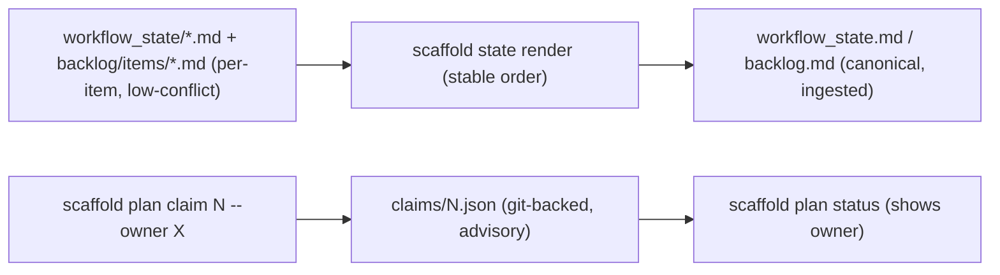

# Feature: AgentScaffold Collaboration Ergonomics (file sharding + plan claim)

## 0. Metadata
- Issue: #TBD
- Branch: feature/agentscaffold-collaboration-ergonomics
- Author: AI agent
- Reviewers: Dave Robb
- Approval Required: Yes (changes the on-disk format of core governance files when enabled; coordination convention)
- Security Review: None (internal docs/state tooling; no new external surface or persistence of secrets)
- Architecture Layer(s): Cross-Cutting (AgentScaffold tooling package)
- Superseded By: None
- Source: STU-2026-06-14-...durability (Thread 6, Phase 2). Depends on Plans 221 (paths), 222 (governance serialization). Sequenced after Plan 225.

## 1. Objective
Reduce multi-writer merge conflicts on the two highest-contention governance files and add a lightweight ownership convention. Success means: (a) `workflow_state` and `backlog` can be stored as per-item fragments (opt-in) and assembled by a render command, so concurrent edits touch different files; (b) `scaffold plan claim <number>` / `release` record git-backed ownership of an in-flight plan; and (c) repos that do not opt in keep the single-file `workflow_state.md` / `backlog.md` exactly as today.

## 2. Non-Goals
- Not a live lock service or server-side coordination (git remains the system of record; claims are advisory, git-backed).
- Not multi-project namespacing (Plan 225) or config inheritance (Plan 224).
- Not auto-resolving git merge conflicts; sharding reduces their frequency, it does not arbitrate them.
- Not forcing migration: sharding is opt-in per repo.

## 3. Constraints / Invariants
- Must not break: existing single-file `workflow_state.md` / `backlog.md` consumers (graph ingestion, MCP `_parse_workflow_state`, validate).
- Backward compatibility: Required. `collab.sharded` defaults to false; with it off, behavior is byte-for-byte today's.
- Render must be deterministic and stable-ordered (minimal diffs), mirroring the Plan 222 governance-artifact stability rule.
- Claims are advisory: a claim is a committed record, not an enforced lock; document that two writers can still both edit (git resolves).
- Breaking change: Yes when enabled (the on-disk format of workflow_state/backlog changes to fragment dirs + a rendered file). See Migration Plan.

## 4. Current State
`workflow_state.md` and `backlog.md` are single append-heavy markdown files (this repo's `workflow_state.md` is already several thousand lines) -- frequent merge-conflict points for concurrent agents/users. Plan 222 established a stable, atomic serialization pattern for governance; Plan 221 unified path resolution. There is no notion of who owns a plan in flight, so two agents can unknowingly work the same plan.

## 5. Target State
An opt-in `collab` config enables fragment storage: `workflow_state/` holds one fragment per entry and `backlog/items/` one file per item; `scaffold state render` assembles them into the canonical `workflow_state.md` / `backlog.md` (stable order) for humans, CI, and graph ingestion. `scaffold plan claim <number> [--owner X]` writes a git-backed claim record under a claims dir (and `release` clears it); `scaffold plan status` surfaces the claim. With `collab.sharded` off, none of this activates and the single files are used as today.



## 6. Migration Plan (breaking when enabled)
- [x] `collab.sharded` defaults to false -> no change for existing repos.
- [x] Provide `scaffold state split` (one-time) to shard an existing `workflow_state.md` / `backlog.md` into fragments; idempotent and reversible via `scaffold state render`.
- [x] Document that enabling sharding is a deliberate per-repo choice; CHANGELOG notes the format and the round-trip (`split` <-> `render`).

## 7. File Impact Map
| File | Change Type | Notes |
|------|-------------|-------|
| src/agentscaffold/config.py | Modify | Add additive `collab` config: `sharded` (default false), `workflow_fragments_dir`, `backlog_items_dir`, `claims_dir` |
| src/agentscaffold/collab.py | Create | Fragment read/write, stable-order render, `split`, claim/release helpers |
| src/agentscaffold/paths.py | Modify | Resolve the new fragment/claims dirs via `ResolvedPaths` |
| src/agentscaffold/cli.py | Modify | `scaffold state render`/`split`; `scaffold plan claim`/`release`; surface claim in `plan status` |
| tests/test_collab.py | Create | render stability, split/render round-trip, claim/release lifecycle, sharded-off backward-compat |
| CHANGELOG.md | Modify | Collaboration ergonomics notes |
| docs/configuration.md | Modify | `collab` config, sharding workflow, claim convention |

## 8. Tests
| Test File | Coverage Target | Notes |
|-----------|-----------------|-------|
| tests/test_collab.py | render is stable/deterministic; split -> render round-trips to the original; claim writes/clears; `plan status` shows owner; sharded-off is a no-op | Unit, tmp dirs |

Test approach:
- [x] Write `test_collab.py` first
- [x] Existing workflow_state/backlog ingestion + MCP parse tests continue to pass (sharded off)
- [x] Edge cases: empty fragments dir; claim already held; release of an unclaimed plan; render ordering determinism

## 9. Execution Steps
- [x] Step 0: Consumer audit -- readers of the canonical `workflow_state.md` / `backlog.md` (graph ingestion, MCP parse, validate) consume the rendered file; sharding leaves the canonical file as the source of truth
- [x] Step 1: Establish baseline -- full `pytest -q` green
- [x] Step 2: Add additive `collab` config (default off); resolve dirs via `ResolvedPaths`
- [x] Step 3: Implement `collab.py` (fragment IO, stable render, split); wrote `test_collab.py` first (12 tests)
- [x] Step 4: Add `scaffold state render`/`split` and `scaffold plan claim`/`release`; surface claim in `plan status`
- [x] Step 5: Verify sharded-off backward-compat; docs + CHANGELOG; full validation (ruff/mypy clean on touched files)

## 10. Validation
```bash
cd .
ruff format .
ruff check .
pytest -q
```

Expected results:
- Ruff + mypy: no errors
- Pytest: sharded-off behavior unchanged; render determinism + claim lifecycle verified

## 11. Rollback Plan
Revert the feature branch. `collab` is additive and defaults off; reverting removes the commands and config with no effect on repos that never enabled sharding. A sharded repo can run `scaffold state render` (kept on the prior commit) before reverting to restore the single files.

## 12. Risks & Mitigations
| Risk | Likelihood | Impact | Mitigation |
|------|------------|--------|------------|
| Render non-determinism reintroduces diffs/conflicts | Medium | Medium | Stable ordering (mirror Plan 222); round-trip test |
| Consumers read fragments instead of the rendered file | Low | Medium | Canonical rendered file remains the ingestion source; Step 0 audit |
| Claims misread as hard locks | Medium | Low | Document advisory/git-backed nature; `plan status` shows owner + timestamp, not a lock |
| Split corrupts a hand-edited monolithic file | Low | Medium | `split` is idempotent and reversible via `render`; back up before first split |

## 13. Completion Checklist
- [x] All execution steps checked off
- [x] Tests written and passing (12 tests in test_collab.py)
- [x] No linter errors (ruff, mypy) on touched files
- [x] workflow_state.md updated
- [ ] Session log entry added (if multi-session)
- [x] Code reviewed (self)
- [x] Approval obtained (recorded in workflow_state.md 2026-06-15)
