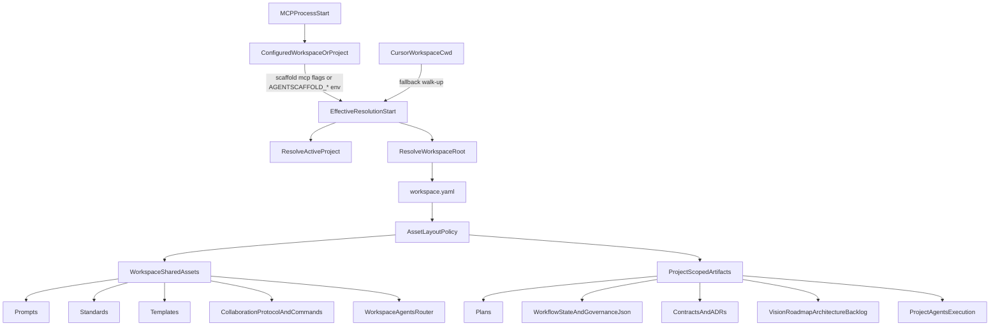

# AgentScaffold shared workspace asset layout

## 0. Metadata
- Issue: #TBD
- Branch: feature/234-agentscaffold-shared-workspace-asset-layout
- Author: Agent
- Reviewers: Human reviewer, AgentScaffold maintainer
- Approval Required: Yes (workspace asset layout changes config/path semantics and generated project structure)
- Security Review: Partial (path resolution and workspace trust-boundary behavior)
- Architecture Layer(s): Cross-Cutting (AgentScaffold governance, config, workspace orchestration)
- Superseded By: None

## 1. Objective
Add first-class AgentScaffold support for a workspace root with shared reusable process assets while each registered project keeps project-scoped planning, state, identity, and history artifacts.

Success means a multi-project workspace (for example `<workspace-root>/` containing `workspace.yaml` and two or more registered projects) can be initialized/onboarded with:

```text
<workspace-root>/
  workspace.yaml
  docs/ai/prompts/
  docs/ai/standards/
  docs/ai/templates/
  docs/ai/collaboration_protocol.md
  docs/ai/commands.md
  AGENTS.md                    # workspace router/policy, not project execution state
  project-a/
    scaffold.yaml
    AGENTS.md                  # project execution authority
    docs/ai/product_vision.md
    docs/ai/strategy_roadmap.md
    docs/ai/system_architecture.md
    docs/ai/architectural_design_changelog.md
    docs/ai/backlog.md
    docs/ai/backlog_archive.md
    docs/ai/plans/
    docs/ai/adrs/
    docs/ai/contracts/
    docs/ai/spikes/
    docs/ai/state/
  project-b/
    scaffold.yaml
    AGENTS.md
    docs/ai/product_vision.md
    docs/ai/strategy_roadmap.md
    docs/ai/system_architecture.md
    docs/ai/architectural_design_changelog.md
    docs/ai/backlog.md
    docs/ai/backlog_archive.md
    docs/ai/plans/
    docs/ai/adrs/
    docs/ai/contracts/
    docs/ai/spikes/
    docs/ai/state/
  nested-group/project-c/
    scaffold.yaml
    AGENTS.md
    docs/ai/product_vision.md
    docs/ai/strategy_roadmap.md
    docs/ai/system_architecture.md
    docs/ai/architectural_design_changelog.md
    docs/ai/backlog.md
    docs/ai/backlog_archive.md
    docs/ai/plans/
    docs/ai/adrs/
    docs/ai/contracts/
    docs/ai/spikes/
    docs/ai/state/
```

The workflow should be one-command or low-friction: users should not have to hand-edit many `graph.*_dir` overrides after `scaffold init` or `scaffold workspace onboard`.

MCP tooling must also resolve the active workspace and project from explicit configuration, not from the Cursor workspace cwd alone. When the IDE opens a parent directory (`<cursor-workspace-root>/`) while the AgentScaffold project lives under a nested path (`<workspace-root>/<project-a>/`), no-argument MCP tools such as `scaffold_orient` must still read governance from the registered project, not from `<cursor-workspace-root>/docs/ai/...`.

## 2. Non-Goals
- Replacing current single-project behavior. Existing projects without `workspace.yaml` or without the new workspace asset-layout policy must behave as they do today.
- Migrating existing duplicated prompts/standards/templates automatically across arbitrary workspaces. Migration can be a later explicit command.
- Changing graph ID qualification or project scoping semantics. Plan numbering can remain per project because graph IDs are already project-qualified in multi-project workspaces.
- Ingesting prompts, standards, or templates as typed governance graph entities. This plan only makes them shared reusable files; graph governance ingestion remains focused on plans, ADRs, contracts, studies, spikes, learnings, findings, and backlog/session data.
- Implementing per-project security isolation. A workspace remains one trust domain; project scoping is a relevance/correctness boundary.

## 3. Constraints / Invariants
- Must not break: single-project `scaffold init`, existing `graph.*` path overrides, existing workspace graph DB sharing, project-qualified graph IDs, MCP current-project resolution when cwd is already inside the project.
- MCP resolution must not depend on raw `Path.cwd()` when an explicit workspace/project root is configured for the MCP process.
- Backward compatibility: default behavior remains project-local governance assets unless `workspace.yaml` opts into the shared workspace layout.
- Performance constraints: path resolution must stay cheap and deterministic on MCP request paths.
- Security constraints: no implicit network/discovery; shared paths must resolve only from explicit `workspace.yaml` or current project config. Absolute paths are honored only as explicit user config.
- Data integrity constraints: project-local `governance.json`, workflow state, backlog, backlog archive, architectural design changelog, system architecture, product vision, strategy roadmap, plan completion log, plans, ADRs, contracts, and spikes must not bleed across project scopes.
- Agent guidance constraints: workspace-root `AGENTS.md` must remain a thin router/policy document; project-root `AGENTS.md` remains the authoritative execution file for that project.
- Breaking change: No.

## 4. Current State
AgentScaffold already supports multi-project workspaces and shared graph DB location:

- `workspace.yaml` registers project roots and enables project-qualified graph IDs.
- `resolve_db_path()` anchors relative graph DB paths at the workspace root.
- `ResolvedPaths` joins governance paths to the active project root.
- `scaffold init` writes a full `docs/ai` governance tree under every initialized project, including reusable prompts, standards, and templates.
- Domain packs install prompts/standards/security assets via `ResolvedPaths`, so they also land in each project by default.

This works technically, but duplicated reusable process assets can drift across projects in a shared workspace.

**MCP cwd mismatch:** When Cursor's workspace root is a parent directory of the AgentScaffold workspace (`<cursor-workspace-root>/` contains `<workspace-root>/` as a subdirectory), the user-level `agentscaffold` MCP server starts with cwd at the Cursor workspace root. `_dispatch_tool()` in `mcp/server.py` sets `root = Path.cwd()` (line ~1081); `_tool_validate()` uses the same pattern for staleness checks (line ~1638). No-argument tools such as `scaffold_orient` therefore resolve governance under `<cursor-workspace-root>/docs/ai/...` instead of `<workspace-root>/<project-a>/docs/ai/...`. CLI commands invoked from a project subdirectory behave correctly because the shell cwd is inside the project; the MCP process cwd is not.

The CLI already has workspace/project scoping helpers (`resolve_workspace_root`, `current_project_name`, `resolve_scope`), but the MCP server does not yet accept a configured resolution anchor, and generated `.cursor/mcp.json` starts `scaffold mcp` with no workspace/project arguments.

## 5. Target State
AgentScaffold has a first-class workspace asset-layout policy in `workspace.yaml`.

Recommended product shape:

```yaml
projects:
  - name: project_a
    path: project-a
  - name: project_b
    path: project-b
  - name: project_c
    path: nested-group/project-c

asset_layout:
  layout: shared_workspace
  shared:
    prompts_dir: docs/ai/prompts
    standards_dir: docs/ai/standards
    templates_dir: docs/ai/templates
    security_dir: docs/security
    collaboration_protocol_file: docs/ai/collaboration_protocol.md
    commands_file: docs/ai/commands.md
  project:
    plans_dir: docs/ai/plans
    adrs_dir: docs/ai/adrs
    contracts_dir: docs/ai/contracts
    spikes_dir: docs/ai/spikes
    state_dir: docs/ai/state
    studies_dir: docs/studies
    runbook_dir: docs/runbook
    backlog_file: docs/ai/backlog.md
    backlog_archive_file: docs/ai/backlog_archive.md
    product_vision_file: docs/ai/product_vision.md
    strategy_roadmap_file: docs/ai/strategy_roadmap.md
    system_architecture_file: docs/ai/system_architecture.md
    architectural_design_changelog_file: docs/ai/architectural_design_changelog.md
```

**MCP configured root (package-side fix, preferred):** The MCP server must support an explicit workspace/project resolution anchor so all tools — including no-argument tools — resolve consistently regardless of Cursor workspace cwd.

Product shape:

```bash
# CLI flags (written into generated .cursor/mcp.json when known at init/agents time)
scaffold mcp --workspace <workspace-root> --project project_a

# Equivalent environment variables (for user-level MCP installs or manual mcp.json)
export AGENTSCAFFOLD_WORKSPACE_ROOT=<workspace-root>
export AGENTSCAFFOLD_PROJECT=project_a
```

Resolution precedence for MCP (and any code path that currently uses bare `Path.cwd()` as the start anchor):

1. Explicit `--project` (resolves project root under the workspace) or `--workspace` alone (workspace root; active project inferred from cwd when cwd is inside a registered project).
2. `AGENTSCAFFOLD_PROJECT` and/or `AGENTSCAFFOLD_WORKSPACE_ROOT` environment variables (same semantics as flags).
3. Walk-up from `Path.cwd()` via existing `resolve_root` / `resolve_workspace_root` / `current_project_name` (current behavior; sufficient when cwd is inside the project).

Implementation sketch: add `resolve_mcp_start(start: Path | None = None) -> Path` (or extend `paths.py` helpers) that applies the precedence above once at MCP startup and passes the effective start path through `_dispatch_tool`, freshness, validate, and composite tool handlers instead of `Path.cwd()`. Update `write_cursor_mcp_json()` to emit `--workspace` / `--project` args when `scaffold init` or `scaffold agents cursor` runs from a registered project in a multi-project workspace.

Resolution rules:

- Shared reusable assets resolve relative to the workspace root.
- Project planning/state/identity/history artifacts resolve relative to the active project root.
- Existing project `graph.*` overrides remain an explicit escape hatch.
- Domain packs default to workspace-shared prompts/standards/security in `shared_workspace` mode, with an explicit project-local override for bespoke domain material.
- MCP/tooling resolves the active project from the configured MCP anchor first, then cwd walk-up, while also knowing the shared workspace asset root when `asset_layout.shared_workspace` is active.
- `collaboration_protocol.md` and `commands.md` are shared workspace process guidance.
- `architectural_design_changelog.md`, `backlog.md`, `backlog_archive.md`, `product_vision.md`, `strategy_roadmap.md`, and `system_architecture.md` are project-local and should not be created at the workspace root.
- `AGENTS.md` exists at both levels with different responsibilities:
  - Workspace-root `AGENTS.md`: declares the workspace as one trust domain, points to shared prompts/standards/templates/protocol/commands, requires active-project resolution from cwd or explicit `--project`, and warns not to write project state from the workspace root unless a project is selected.
  - Project-root `AGENTS.md`: remains the authoritative execution file for that project, points to project-local plans/ADRs/contracts/spikes/state/backlog/architecture/vision, and references shared workspace assets for reusable process guidance.



## 6. File Impact Map
| File | Change Type | Notes |
|-----|------------|-------|
| `src/agentscaffold/config.py` | Modify | Add workspace asset-layout schema/models and validation. Consumer audit required for `WorkspaceConfig` and `GraphConfig`. |
| `src/agentscaffold/paths.py` | Modify | Teach `ResolvedPaths` to distinguish workspace-root shared assets from project-root artifacts while preserving existing defaults; add MCP/workspace resolution anchor helpers (`resolve_mcp_start` or equivalent) with flag/env precedence over raw cwd. |
| `src/agentscaffold/mcp/server.py` | Modify | Replace bare `Path.cwd()` in `_dispatch_tool`, `_tool_validate`, and related handlers with the configured MCP start anchor. |
| `src/agentscaffold/agents/cursor.py` | Modify | Emit `--workspace` / `--project` in generated `.cursor/mcp.json` when init/agents runs from a registered multi-project workspace; document env-var fallback in skip-if-exists diff suggestion. |
| `src/agentscaffold/init_cmd.py` | Modify | Split init output into shared reusable assets and project-local artifacts when workspace policy opts in; keep architecture/product/backlog/history files project-local. |
| `src/agentscaffold/cli.py` | Modify | Add `--workspace` / `--project` to `scaffold mcp`; update `workspace onboard` low-friction setup; remove hardcoded `docs/ai/standards` in `agents skills`. |
| `src/agentscaffold/domain_packs/loader.py` | Modify | Add workspace/project install scope behavior for domain prompts/standards/security. |
| `src/agentscaffold/graph/governance.py` | Review/modify if needed | Confirm project-scoped ingestion uses project-local paths and does not ingest shared reusable assets as project state. |
| `src/agentscaffold/graph/pipeline.py` | Review/modify if needed | Confirm governance fingerprinting remains correct with project-local governance state and shared reusable assets. |
| `src/agentscaffold/agents/generate.py` | Modify | Generate/update workspace-root `AGENTS.md` as a router/policy doc and project-root `AGENTS.md` as project execution authority. |
| `src/agentscaffold/agents/rule_policy.py` | Review/modify if needed | Ensure generated MCP/routing policy describes workspace shared governance behavior if needed. |
| `src/agentscaffold/templates/agents/agents_md.md.j2` | Modify | Teach project-root AGENTS template to reference shared workspace assets when `asset_layout.shared_workspace` is active. |
| `src/agentscaffold/templates/agents/workspace_agents_md.md.j2` | Add template | Thin workspace router/policy AGENTS template. |
| `templates/scaffold_yaml.yaml.j2` | Modify | Emit any necessary project-local config defaults without requiring many manual `graph.*` overrides. |
| `docs/configuration.md` | Modify | Document workspace asset-layout policy and path resolution rules. |
| `docs/getting-started.md` | Modify | Update generated layout examples and workspace onboarding flow. |
| `docs/user-guide.md` | Modify | Explain shared workspace governance usage in MCP/NL workflows. |
| `docs/domain-packs.md` | Modify | Document workspace-shared versus project-local domain pack install scope. |
| `docs/platform-integration.md` | Modify | Document MCP `--workspace`/`--project` setup, env-var fallback, and parent-cursor-workspace troubleshooting. |
| `tests/test_workspace_asset_layout.py` | Add test | Focused schema/path/init behavior for shared workspace asset layout. |
| `tests/test_workspace_namespacing.py` | Modify/add tests | Workspace manifest validation and backward-compatible no-policy behavior. |
| `tests/test_path_resolution_integration.py` | Modify/add tests | Path resolution compatibility for explicit `graph.*` overrides and workspace shared paths; MCP anchor precedence (flags/env beat cwd walk-up). |
| `tests/test_init.py` | Modify/add tests | Init/onboard generation writes shared assets once and project artifacts per project. |
| `tests/test_domain.py` | Modify/add tests | Domain pack install scope defaults and overrides. |
| `tests/test_agent_generation.py` | Modify/add tests | Generated project AGENTS references shared assets; workspace AGENTS stays thin and does not claim project execution state. |
| `tests/test_multiproject_safety.py` | Modify/add tests if needed | MCP/current-project behavior remains scoped with shared governance assets. |
| `tests/test_mcp_server.py` | Modify/add tests | MCP resolves project governance from configured `--workspace`/`--project` or env vars when cwd is outside the project (parent Cursor workspace repro). |

## 7. Tests
| Test File | Coverage Target | Notes |
|-----------|-----------------|-------|
| `tests/test_workspace_asset_layout.py` | New workspace asset-layout schema and path resolution | Validate `project_local` default and `shared_workspace` policy, including shared vs project-local file split. |
| `tests/test_path_resolution_integration.py` | `ResolvedPaths` + MCP anchor | Explicit `graph.*` overrides still win; shared assets resolve from workspace root; flags/env beat cwd walk-up. |
| `tests/test_init.py` | Init/onboard layout generation | Shared prompts/standards/templates written once; project plans/state dirs created per project. |
| `tests/test_domain.py` | Domain install scoping | Workspace-shared default in `shared_workspace`; project-local override remains possible. |
| `tests/test_agent_generation.py` | Generated rules/skills/AGENTS | `agents skills` and platform rules use resolved standards/prompts paths; workspace/project AGENTS have distinct responsibilities. |
| `tests/test_multiproject_safety.py` | Current-project behavior | Project-local governance artifacts remain scoped by cwd/project. |
| `tests/test_mcp_server.py` | MCP configured root | `scaffold_orient` and staleness validate read project paths when MCP cwd is a parent directory. |

Test approach:
- [ ] Unit tests for workspace asset-layout Pydantic schema defaults/validation.
- [ ] Path-resolution tests for workspace-shared vs project-local artifacts.
- [ ] Init/onboard integration tests using a temp workspace with two projects.
- [ ] Agent generation tests for workspace-root router `AGENTS.md` and project-root execution `AGENTS.md`.
- [ ] Domain pack install tests for workspace and project scopes.
- [ ] Backward-compatibility tests for no `workspace.yaml` and no `asset_layout` block.
- [ ] MCP resolution tests with parent-directory cwd plus `--workspace`/`--project` or `AGENTSCAFFOLD_*` env vars.
- [ ] Generated `.cursor/mcp.json` includes workspace/project args in multi-project workspaces.

## 8. Execution Steps
- [ ] Step 0: Consumer Audit for modified config/path classes
  - Run `rg "WorkspaceConfig" src tests --type py`.
  - Run `rg "GraphConfig" src tests --type py`.
  - Run `rg "ResolvedPaths" src tests --type py`.
  - Verify all constructor/field consumers are represented in the File Impact Map.
- [ ] Step 1: Add workspace asset-layout schema to `config.py`.
- [ ] Step 2: Add MCP resolution anchor helpers in `paths.py` (`AGENTSCAFFOLD_WORKSPACE_ROOT`, `AGENTSCAFFOLD_PROJECT`, and CLI flag parity).
- [ ] Step 3: Wire MCP server and `scaffold mcp` CLI to use the anchor instead of bare `Path.cwd()`; update `write_cursor_mcp_json()` for multi-project workspaces.
- [ ] Step 4: Add MCP configured-root tests (`test_mcp_server.py`, path-resolution integration).
- [ ] Step 5: Update `ResolvedPaths` and path helpers for dual-anchor shared/project resolution.
- [ ] Step 6: Add tests for schema defaults, path resolution, and backward compatibility.
- [ ] Step 7: Update `scaffold init` and `workspace onboard` to create/wire the shared layout.
- [ ] Step 8: Add init/onboard integration tests for the desired multi-project shared-workspace layout.
- [ ] Step 9: Update domain pack install scoping and tests.
- [ ] Step 10: Update workspace-root and project-root `AGENTS.md` generation and tests.
- [ ] Step 11: Update generated skills/rules path consumers and tests.
- [ ] Step 12: Verify graph ingestion, governance fingerprinting, and MCP current-project behavior (including parent-cwd repro).
- [ ] Step 13: Update package documentation (configuration, platform-integration, user-guide MCP setup).
- [ ] Step 14: Run validation commands and update this plan with any deviations.

## 9. Validation
```bash
cd .
uv run pytest tests/test_workspace_asset_layout.py tests/test_workspace_namespacing.py tests/test_path_resolution_integration.py tests/test_init.py tests/test_domain.py tests/test_agent_generation.py tests/test_multiproject_safety.py tests/test_mcp_server.py
uv run pytest
uv run ruff check .
uv run mypy src/agentscaffold
```

Expected results:
- Targeted tests pass and prove shared assets resolve at the workspace root while project artifacts remain scoped.
- Full package tests pass.
- Ruff and mypy report no errors.
- Existing single-project fixtures and path customization tests continue to pass unchanged or with only intentional expectation updates.

## 10. Rollback Plan
- Revert the implementation commit(s) for this plan.
- Existing workspaces without the new `asset_layout` block are unaffected.
- MCP behavior without `--workspace`/`--project` or env vars remains cwd walk-up (unchanged for repos where Cursor cwd is already the project root).
- For a workspace that adopted `asset_layout.layout: shared_workspace`, rollback is config-only: remove the `asset_layout` block or set `layout: project_local`, then re-run `scaffold init`/`scaffold domains add` per project if project-local copies are desired.
- No graph data migration is required; a full `scaffold index` can rebuild the graph if path policy changes during rollback.

## 11. Risks & Mitigations
| Risk | Likelihood | Impact | Mitigation |
|------|------------|--------|------------|
| Shared prompts/standards drift from project-specific needs | Medium | Medium | Add explicit domain install `--scope project` override and document when to use it. |
| Backward compatibility break for customized `graph.*` paths | Medium | High | Treat explicit project config overrides as highest precedence and add regression tests. |
| Active project resolution reads sibling project state | Low | High | Keep project planning/state paths project-root anchored and extend multiproject safety tests. |
| Users are surprised that workspace is not a security boundary | Medium | Medium | Document trust boundary clearly in configuration/user guide and generated rules. |
| Init/onboard behavior becomes too magical | Medium | Medium | Make shared layout opt-in via explicit workspace policy/flag and print a summary of shared vs project-local outputs. |
| Domain packs installed in the wrong scope | Medium | Medium | Default to workspace scope only when `shared_workspace` is configured; print destination scope and add `--scope` override. |
| Workspace-root agent session writes project state to the wrong place | Medium | High | Generate a thin workspace `AGENTS.md` that requires cwd/current-project resolution or explicit `--project` before editing project artifacts. |
| Project-root `AGENTS.md` drifts from shared process assets | Medium | Medium | Generate project `AGENTS.md` to reference shared workspace prompts/standards/templates instead of copying their contents. |
| MCP cwd at Cursor workspace root reads wrong project's governance | High | High | Implement configured MCP workspace/project anchor; emit args in `.cursor/mcp.json`; document env-var fallback for user-level MCP installs; add parent-cwd regression test. |
| Stale user-level `.cursor/mcp.json` without workspace/project args | Medium | High | Print diff suggestion on `scaffold agents cursor` when existing mcp.json lacks required args; document manual upgrade in platform-integration guide. |

## 12. Completion Checklist
- [ ] All execution steps checked off
- [ ] Tests written and passing
- [ ] No linter errors (ruff, mypy)
- [ ] workflow_state.md updated
- [ ] Session log entry added (if multi-session)
- [ ] Code reviewed (self or peer)
- [ ] Approval obtained (required before implementation)

## Appendix A: Design Rationale
The problem is not graph scoping. AgentScaffold already qualifies graph IDs by project in multi-project workspaces, so plan numbers can remain local (`001-*`) inside each project.

The friction is duplicated reusable process material. Today `scaffold init` creates prompts, standards, templates, collaboration protocol, commands, project vision, roadmap, architecture, backlog, and changelog files under every project. That is technically valid but awkward for a shared workspace because some files are common process assets while others are project-specific history and identity.

The preferred model separates reusable process assets from project state and identity:

- Workspace shared: prompts, standards, templates, shared security templates, `collaboration_protocol.md`, and `commands.md`.
- Project local: plans, ADRs, contracts, spikes, workflow state, backlog, backlog archive, learnings, plan completion log, governance JSON, runbook, studies, `architectural_design_changelog.md`, `product_vision.md`, `strategy_roadmap.md`, and `system_architecture.md`.
- Agent guidance split: workspace-root `AGENTS.md` is a router/policy file for shared-process navigation, while project-root `AGENTS.md` remains the authoritative execution guide for a project.

This mirrors how humans reason about a workspace: one process, many project histories.

The MCP cwd mismatch is a separate but blocking ergonomics issue for the same layout. Shared workspace assets only help when MCP tools resolve the correct project root; parent-directory Cursor workspaces break no-argument tools today because the MCP process anchors on `Path.cwd()` instead of configured workspace/project roots.

## Appendix B: Desired Example Layout
```text
<workspace-root>/
  workspace.yaml
  AGENTS.md
  docs/
    ai/
      collaboration_protocol.md
      commands.md
      prompts/
      standards/
      templates/
  project-a/
    scaffold.yaml
    AGENTS.md
    docs/
      ai/
        product_vision.md
        strategy_roadmap.md
        system_architecture.md
        architectural_design_changelog.md
        backlog.md
        backlog_archive.md
        plans/
        adrs/
        contracts/
        spikes/
        state/
  project-b/
    scaffold.yaml
    AGENTS.md
    docs/
      ai/
        product_vision.md
        strategy_roadmap.md
        system_architecture.md
        architectural_design_changelog.md
        backlog.md
        backlog_archive.md
        plans/
        adrs/
        contracts/
        spikes/
        state/
  nested-group/
    project-c/
      scaffold.yaml
      AGENTS.md
      docs/
        ai/
          product_vision.md
          strategy_roadmap.md
          system_architecture.md
          architectural_design_changelog.md
          backlog.md
          backlog_archive.md
          plans/
          adrs/
          contracts/
          spikes/
          state/
```

## Appendix C: MCP cwd mismatch repro

**Path notation (used throughout this plan):**

| Placeholder | Meaning |
|-------------|---------|
| `<cursor-workspace-root>/` | Directory Cursor opens as the IDE workspace (often a home dir or monorepo parent) |
| `<workspace-root>/` | AgentScaffold workspace root containing `workspace.yaml` |
| `<project-a>/` | A registered project directory under the workspace |
| `project_a` | Registered project name in `workspace.yaml` (need not match directory spelling) |

**Scenario:** Cursor opens `<cursor-workspace-root>/` while AgentScaffold projects live under `<workspace-root>/`, a subdirectory of the Cursor workspace.

Symptoms:

- User-level `agentscaffold` MCP server process cwd is `<cursor-workspace-root>/`.
- `scaffold_orient` (no arguments) returns plans/state from `<cursor-workspace-root>/docs/ai/...` (missing or wrong) instead of `<workspace-root>/<project-a>/docs/ai/...`.
- Shell CLI from `cd <workspace-root>/<project-a>` works because shell cwd is inside the project.

Root cause in package:

- `src/agentscaffold/mcp/server.py` — `_dispatch_tool()` sets `root = Path.cwd()` (~1081).
- Same file — `_tool_validate(check="staleness")` passes `Path.cwd()` to `verify_graph()` (~1638).
- Generated `.cursor/mcp.json` runs `scaffold mcp` with no workspace/project configuration.

Expected fix (this plan):

```json
{
  "mcpServers": {
    "agentscaffold": {
      "command": "scaffold",
      "args": [
        "mcp",
        "--workspace", "<workspace-root>",
        "--project", "project_a"
      ]
    }
  }
}
```

Or equivalent env vars on the MCP server process:

```bash
export AGENTSCAFFOLD_WORKSPACE_ROOT=<workspace-root>
export AGENTSCAFFOLD_PROJECT=project_a
```

Acceptance check: with Cursor workspace cwd at `<cursor-workspace-root>/`, `scaffold_orient` must report workflow state and plans for `project_a`, not an empty or sibling-path governance tree.
